# Importing your robot from URDF - a tutorial
 
[Unified Robot Definition Format](http://wiki.ros.org/urdf/XML) (URDF) is a standard for description of robots used widely in the ROS ecosystem.
O3DE supports URDF through its ROS 2 Gem. The feature of URDF import is still in development.
This document will guide you through the process of importing a robot and covers the steps necessary to make it mobile.

## 1. Before you start

- Follow the instructions in the [project README](https://github.com/o3de/RobotHarvestingSample) to build and test the orchard demo project.
- Examples in the demo use the .xacro extension, which is helpful for parametrization of robot definition. 
To follow the guide, you need this package installed:
```bash
sudo apt install ros-$ROS_DISTRO-xacro
```

## 2. Prepare the URDF file

First, we need to produce our URF file out of the .xacro file. This is typically done through running a command and specifying robot parameters.
For this example, we will use default values.

In `RobotHarvestingSample` folder run:

```bash
cd Project/Assets/applekraken_urdf
xacro apple_kraken.xacro > apple_kraken_new.urdf
```

## 3. Import URDF into O3DE

Run the RobotHarvestingSample O3DE project, load `Main` level and import `apple_kraken_new.urdf` file using `RobotImporter` button. 
The `apple_kraken_new` prefab should appear in the `Entity Outliner`.

The robot imported in this way should look correct and have all the parts included. 
However, URDF format itself does not include specification of simulation behavior. To enable robot mobility, we need to set up the vehicle control.

## 4. Set up the vehicle control

In the `apple_kraken_new` prefab:

1. Add a `Wheel controller` component to entities: `wheel_rear_right_link` and `wheel_rear_left_link`. Leave all settings default.
2. Add a `Wheel controller` component to entities: `wheel_front_right_link` and `wheel_front_left_link`. Set the `Steering entity` to `steering_front_right_link` and `steering_front_left_link` respectively (by dragging these entities from the `Entity Outliner`). Leave other properties default.


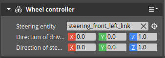


3. In the `base_link` entity add a `Vehicle Model` component. In this component:
    - Add 2 new axles by clicking `+` next to `Axles`. 
    - In the first of these axles:
      - Set `Axle tag` to `Front`
      - Add 2 wheels by clicking `+` next to `Axle wheels`
      - Set the first of these wheels to `wheel_front_left_link` and the second to `wheel_front_right_link` (by dragging these entities from the `Entity Outliner`). 
      - Turn on `Is it a steering axle` switch.
    - In the second of these axles:
      - Set `Axle tag` to `Rear`
      - Add 2 wheels by clicking `+` next to `Axle wheels`
      - Set the first of these wheels to `wheel_rear_left_link` and the second to `wheel_rear_right_link` (by dragging these entities from the `Entity Outliner`). 
      - Turn on the `Is it a drive axle` switch.
    - In the `Drive model`/`Steering PID` set:
      - `P`: `1000.0`
      - `OutputLimit`: `200.0`
    - In the `Drive model`/`Speed PID` set:
      - `P`: `250.0`
      - `I`: `150.0`
      - `Imax`: `500.0`
      - `OutputLimit`: `500.0`
      - Turn on the `AntiWindUp` switch
    - In the `Vehicle limits` set `Speed limit` to `3.0`
    - Leave all the other settings default. The component should look like this:

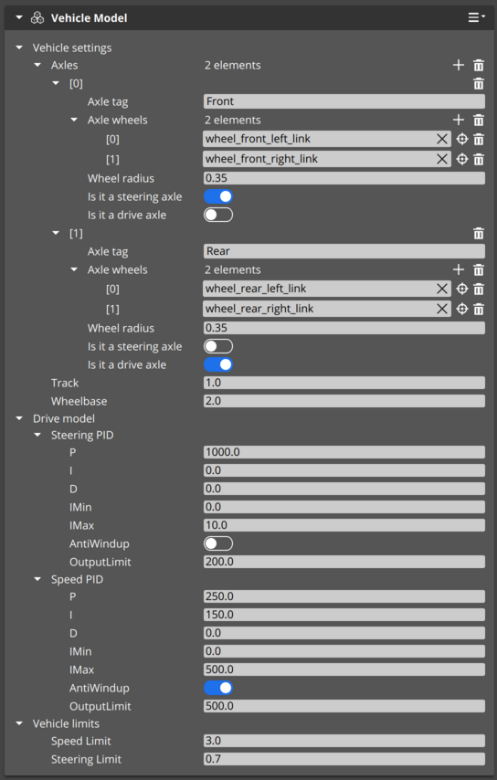

4. In the `base_link` entity select `ROS2 Robot control` component and change `Topic` to `ackermann_vel`, `Type` to `ackermann_msgs::msg::AckermannDrive` and `Steering` to `Ackermann`.

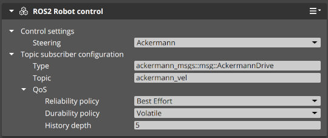

5. In the `base_link` entity add a `Ackermann Control` component. 
6. In the `base_link` entity add a `Tag` component. Add 1 tag by clicking `+` next to `Tags` and set the name to `Robot`.
7. In the `base_link` entity add an `Input` component and in the `Input to event bindings` field select `mobile_robot_control_keyboard.inputbindings`.

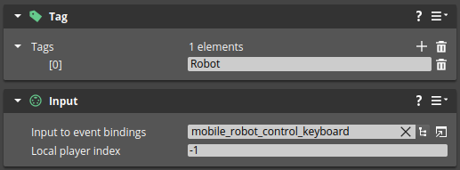

In the following step, we will set properties for the manipulator so that it behaves better. Note that desired behavior can be achieved in other
ways, but for the purpose of this demo we are going for a simple solution.

## 5. Set collision layers and Rigid Body parameters

- Browse each entity in the `apple_kraken_new` prefab and find all `PhysX Collider` components. Change `Collision Layer` to `Robot` in each.
- Select the `PhysX Rigid Body` component and turn off `Gravity enabled` checkbox in following entities:
    - `kraken_manipulator_link_1`
    - `kraken_manipulator_link_2`
    - `kraken_manipulator_link_3`
    - `kraken_manipulator_link_4`
    - `Effector`

## 6. Test robot mobility

Now it is a good time to test the robot. Check that the robot is located over the ground (but not too high) and set a camera to see the robot. 
Click the Play button in the right-top corner of the O3DE window, or press `Ctrl G`.
You should be able to control robot movement using arrow keys.

URDF format by itself does not specify sensor behavior (unless through Gazebo extensions). Now, we will now add a LIDAR to our robot.

## 7. Add LIDAR

Select the `lidar_mount` entity in the `apple_kraken_new` prefab, open the right-click menu and select `Instantiate Prefab`.
Select `RobotHarvestingSample/Project/Prefabs/LidarKraken.prefab` and click `OK`. Enter the `LidarKraken` prefab, select `Sensor` entity and change:
1. Set `Ignore layer` to `True`
2. Set `Ignored layer index` to `1`

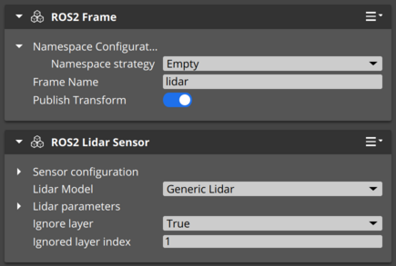

## 8. Test robot navigation

Select `base_link` entity and change its name to `apple_kraken_rusty_1`.
This step ensures that our namespace is the same as if the robot was spawned and as such compatible with the demo instructions.

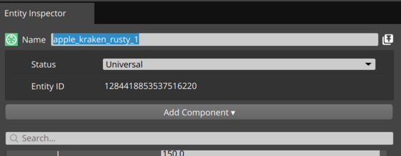

Follow instructions in the [o3de_kraken_nav](https://github.com/o3de/ROSConDemo/blob/development/kraken_nav/README.md) to install the navigation stack.
After the `Installation` part run the O3DE simulation (`ctrl-g`), switch to terminal and run the following commands:

```bash
source /opt/ros/$ROS_DISTRO/setup.bash
cd ~/o3de_kraken_ws
source ./install/setup.bash
export RMW_IMPLEMENTATION=rmw_cyclonedds_cpp
ros2 launch o3de_kraken_nav navigation_multi.launch.py namespace:=apple_kraken_rusty_1 rviz:=True
```

You should see something like this:

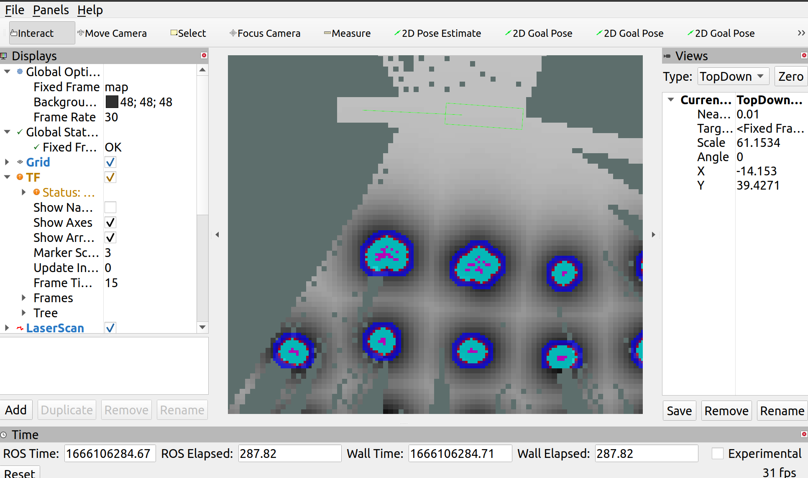

The following steps are dedicated to setting up the manipulator and fine-tuned parameters for its controllers:

## 9. Set up the manipulator

In the `apple_kraken_new` prefab:

1. Open the `kraken_manipulator_link_1` entity and add a `MotorizedJoint` component:
   - Set `ControllerLimits` to `0.6` and `2.2`
   - Turn off the `Animation mode` switch
   - Set `Zero off.` to `1.65`
   - In `PidPosition` set:
     - `P` to `1200.0`
     - `D` to `600.0`
     - `OutputLimit` to `500.0`
   - Turn off the `SinusoidalTest` switch


2. Open the `kraken_manipulator_link_2` entity and add a `MotorizedJoint` component:
   - Set `Joint Dir.` to `1.0, 0.0, 0.0`
   - Set `ControllerLimits` to `-0.5` and `1.5`
   - Turn off the `Animation mode` switch
   - In `PidPosition` set:
     - `P` to `1500.0`
     - `D` to `600.0`
     - `OutputLimit` to `500.0`
   - Turn off the `SinusoidalTest` switch


3. Open the `kraken_manipulator_link_4` entity and add a `MotorizedJoint` component:
   - Set `Joint Dir.` to `0.0, -1.0, 0.0`
   - Set `ControllerLimits` to `0.35` and `0.95`
   - Set `Zero off.` to `0.36`
   - Turn off the `Animation mode` switch
   - In `PidPosition` set:
     - `P` to `250.0`
     - `D` to `50.0`
     - `OutputLimit` to `250.0`
   - Turn off the `SinusoidalTest` switch
   - Set `Step Parent` to `kraken_manipulator_link_2` (by dragging entity from the Entity Outliner)

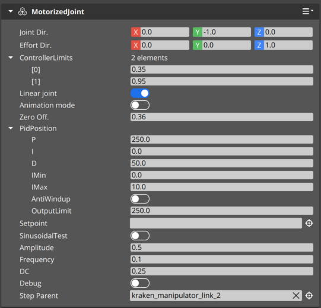

4. Open the `apple_kraken_rusty_1` entity and add a `ManipulatorController` component:
   - Set `m_entityX` to `kraken_manipulator_link_2` (by dragging entity from the Entity Outliner)
   - Set `m_entityY` to `kraken_manipulator_link_4`
   - Set `m_entityZ1` to `kraken_manipulator_link_1`
   - Set `vz` to `0.0, 0.0, -1.0` 
   - Set `Rest entity` to `Rest`
   - Set `Effector` to `Effector`

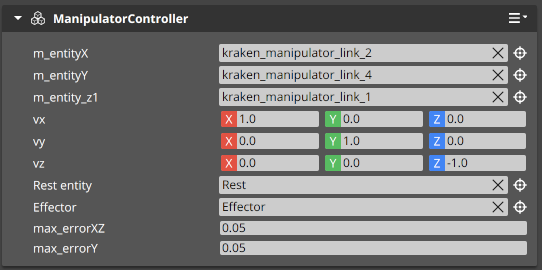

5. In `apple_kraken_rusty_1`, add a `Apple picking component` component:
   - Set `Effector` to `base_link` or `apple_kraken_rusty_1`
   - Set `Fruit Storage` to `base_link` or `apple_kraken_rusty_1`
   - Set `Retrieval point` to `RetrievalChute`

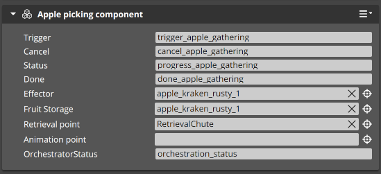

6. In `apple_kraken_rusty_1`, add a `Kraken Effector` component:
   - Set `Kraken Reach entity` to `Reach_visual`
   - Set `Entity with manipulator` to `base_link` or `apple_kraken_rusty_1`
   - Set `BaseLinkToKinematic` to `base_link` or `apple_kraken_rusty_1`

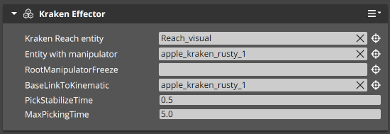


## 10. Test the manipulator

Drive or place the Apple Kraken next to one of apple trees:

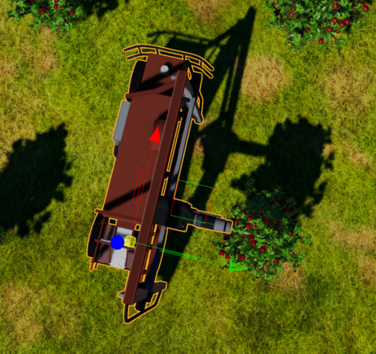

You can now start the process of automated apple gathering.
When the simulation is running, run these commands in a bash console:

```bash
source /opt/ros/$ROS_DISTRO/setup.bash
ros2 service call /apple_kraken_rusty_1/trigger_apple_gathering std_srvs/srv/Trigger
````

You should see the manipulator picking apples.